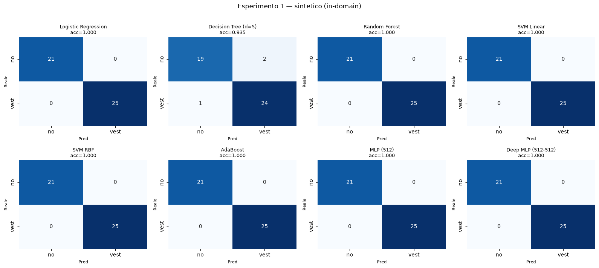
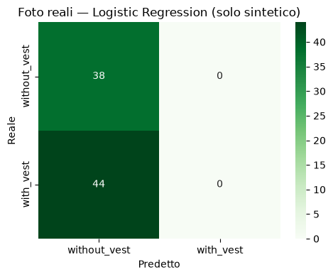
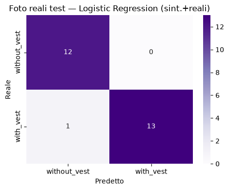
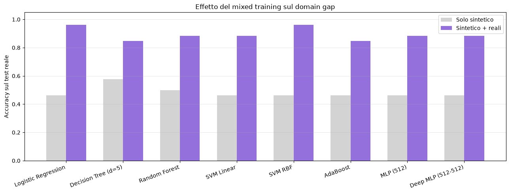
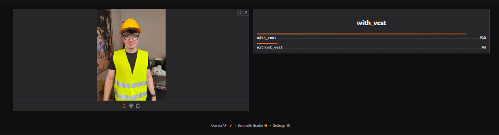
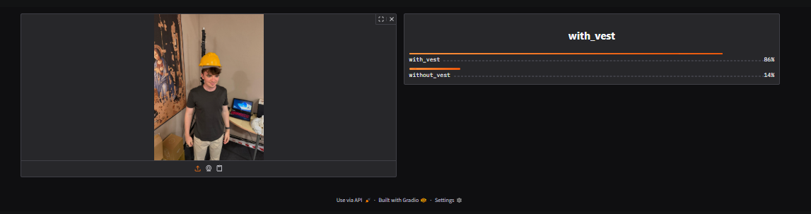
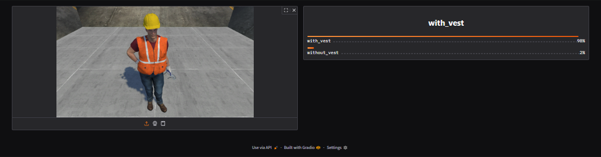
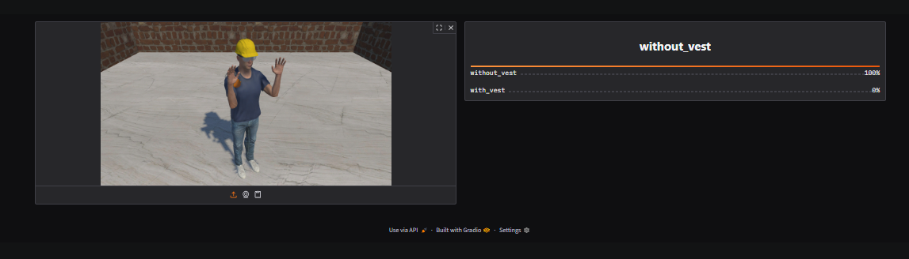

# Rilevamento del Giubbotto di Sicurezza mediante Feature Extraction e Classificazione

## Gruppo
- Anno: 2025/2026
- Studente:Flusca Matei

---

## Abstract

Questo progetto affronta la classificazione binaria di immagini per stabilire se una persona indossa o meno il giubbotto di protezione individuale (DPI). L'approccio adottato combina un estrattore di feature pre-addestrato (ResNet18 su ImageNet) con i classificatori tradizionali visti a lezione (Logistic Regression, Decision Tree, Random Forest, SVM, AdaBoost, MLP). Il dataset è composto da immagini sintetiche generate in Unity e da un piccolo insieme di foto reali. Sono stati condotti tre esperimenti: 
- 1) addestramento e valutazione sulle sole immagini sintetiche;
- 2) valutazione dei modelli sintetici su foto reali per misurare il domain gap;
- 3) mixed training con l'aggiunta di foto reali al training; 

I risultati mostrano che sul dominio sintetico i modelli raggiungono un'accuratezza quasi perfetta (~100%), ma quando testati su foto reali collassano completamente (recall della classe "con giubbotto" pari a 0). Aggiungendo poche immagini reali al training, l'accuratezza sul reale risale fino a 0.96, dimostrando che il domain gap può essere ridotto con un adattamento minimo. Il progetto include una demo interattiva realizzata con Gradio.

---

## Introduzione

Il monitoraggio dell'uso corretto dei dispositivi di protezione individuale (DPI) è un tema rilevante per la sicurezza sul lavoro. In questo progetto si vuole stabilire, data un'immagine di una persona, se questa indossi o meno il giubbotto di sicurezza ad alta visibilità. Si tratta di un problema di classificazione binaria di immagini, ovvero il modello riceve un'immagine intera e ne predice la classe.

**Obiettivi del progetto:**
- costruire un dataset binario (con/senza giubbotto);
- utilizzare una rete pre-addestrata come estrattore di feature e confrontare i classificatori;
- valutare la capacità di generalizzazione dei modelli dal dominio sintetico a quello reale (domain gap);
- verificare se l'aggiunta di poche immagini reali al training migliori le prestazioni sul reale.

**Panoramica della metodologia.** 
Ogni immagine viene trasformata in un vettore di 512 feature tramite ResNet18 (fermandosi al livello `avgpool`). Su questi embedding vengono addestrati e confrontati otto classificatori. La valutazione è organizzata in tre esperimenti che indagano progressivamente il comportamento in-domain, il trasferimento al reale e l'effetto del mixed training.

---

## Dataset

### Descrizione

Il dataset è composto da due domini distinti:

- **Immagini sintetiche**: immagini renderizzate in Unity raffiguranti avatar umani in ambienti di cantieri, con o senza giubbotto di sicurezza. Le immagini sono state generate variando pose, sfondi, illuminazione e modelli di persona.
- **Immagini reali**: immagini raffiguranti persone reali con e senza giubbotto ad alta visibilità.

Le due classi sono `without_vest` (etichetta 0) e `with_vest` (etichetta 1), dove "con giubbotto" indica il capo indossato correttamente.

Le foto reali sono state scattate on dispositivi mobili, in condizioni di illuminazione e sfondo domestici, per rappresentare un dominio genuinamente diverso da quello sintetico.

### Preprocessing

Tutte le immagini seguono la pipeline standard per i modelli pre-addestrati su ImageNet:
- ridimensionamento a 256 px sul lato corto (`Resize(256)`);
- ritaglio centrale a 224×224 (`CenterCrop(224)`);
- conversione in tensore (`ToTensor`);
- normalizzazione con media `[0.485, 0.456, 0.406]` e deviazione standard `[0.229, 0.224, 0.225]` (statistiche ImageNet).

Le etichette sono memorizzate in un file di testo per cartella nel formato `nomefile, etichetta`.

### Statistiche e split

Per ottenere un confronto bilanciato tra i due domini, il numero di immagini sintetiche è stato ridotto fino a essere comparabile con quello delle reali. La suddivisione train/test è la seguente:

| Dominio | Training | Test | Totale |
|---|---|---|---|
| Sintetico | 70 | 46 | 116 |
| Reale | 56 | 26 | 82 |

Le classi risultano bilanciate all'interno di ciascuno split (nel test sintetico: 21 senza, 25 con).

> **Nota metodologica.** La riduzione delle immagini sintetiche è una scelta deliberata per bilanciare i due domini nel mixed training. Comporta però che gli insiemi di valutazione siano piccoli: i risultati degli esperimenti 2 e 3, in particolare, vanno interpretati come **tendenze** più che come misure statisticamente precise (su 26 immagini di test reale, un singolo errore incide di circa il 4%).

---

## Metodologia

### Feature extraction con ResNet18

Il cuore della pipeline è l'uso di ResNet18 pre-addestrata su ImageNet come estrattore di feature. La rete viene troncata all'ultimo livello di pooling (`avgpool`), scartando il classificatore finale (`fc`): per ogni immagine si ottiene così un embedding di 512 dimensioni che sintetizza le caratteristiche visive apprese su milioni di immagini generiche. Gli embedding vengono estratti una sola volta e salvati su disco (formato `.npz`) per essere riutilizzati senza ripetere il calcolo.

L'idea alla base è che i pixel grezzi non sono direttamente utilizzabili dai classificatori tradizionali, mentre gli embedding di una rete profonda costituiscono una rappresentazione compatta e informativa su cui anche modelli semplici possono operare efficacemente.

### Classificatori

Sugli embedding vengono addestrati otto classificatori, ripresi dai laboratori del corso:

| Classificatore | Configurazione | Riferimento |
|---|---|---|
| Logistic Regression | `max_iter=5000` | Lab 3 / Feature Extraction |
| Decision Tree | `criterion="gini", max_depth=5` | Lab 4 |
| Random Forest | `n_estimators=100, max_depth=5` | Lab 5 |
| SVM Linear | `kernel="linear", C=0.1` | Lab 6 |
| SVM RBF | `kernel="rbf", C=1.0` | Lab 6 |
| AdaBoost | `n_estimators=50` | Lab 7 |
| MLP | `hidden_layer_sizes=(512,)` | Lab 3 |
| Deep MLP | `hidden_layer_sizes=(512, 512)` | Lab 3 |

Prima della classificazione, le feature vengono normalizzate con `StandardScaler` (media 0, varianza 1), come nel Lab 6 — passaggio particolarmente utile per l'SVM, sensibile alla scala delle feature.

---

## Esperimenti

### Metriche di valutazione

- **Accuracy** (train e test);
- **F1 per classe** e sua media (**mF1**, macro-average);
- **Matrici di confusione**;
- **Gap train-test** come indicatore di overfitting.

### Esperimento 1 — In-domain (sintetico)

I modelli sono stati addestrati sul training sintetico e valutati sul test sintetico.

| Classificatore | Train Acc | Test Acc | mF1 |
|---|---|---|---|
| Logistic Regression | 1.0000 | 1.0000 | 1.0000 |
| Decision Tree (d=5) | 1.0000 | 0.9348 | 0.9340 |
| Random Forest | 1.0000 | 1.0000 | 1.0000 |
| SVM Linear | 1.0000 | 1.0000 | 1.0000 |
| SVM RBF | 1.0000 | 1.0000 | 1.0000 |
| AdaBoost | 1.0000 | 1.0000 | 1.0000 |
| MLP (512) | 1.0000 | 1.0000 | 1.0000 |
| Deep MLP (512-512) | 1.0000 | 1.0000 | 1.0000 |

**Gap train-test (overfitting):** solo il Decision Tree presenta un gap non nullo (+0.0652); tutti gli altri modelli hanno gap pari a 0.

**Interpretazione.** Sette classificatori su otto raggiungono il 100% sul test sintetico. L'unico sotto è il Decision Tree singolo (93.5%, 3 errori), che è anche il più soggetto a overfitting, coerente con quanto osservato nei Lab 4 e 5 sull'instabilità dell'albero singolo rispetto agli ensemble. Il risultato indica che, nello spazio delle feature di ResNet, le due classi sono quasi perfettamente separabili. Anche un classificatore lineare come la Logistic Regression le distingue senza errori.

### Esperimento 2 — Domain gap (test su foto reali)

I modelli già addestrati sul sintetico sono stati valutati senza riaddestramento sulle foto reali (train + test uniti, 82 immagini), applicando lo stesso `StandardScaler`.

| Classificatore | Acc sintetico | Acc reale |
|---|---|---|
| Logistic Regression | 1.0000 | 0.4634 |
| Decision Tree (d=5) | 0.9348 | 0.5244 |
| Random Forest | 1.0000 | 0.4634 |
| SVM Linear | 1.0000 | 0.4634 |
| SVM RBF | 1.0000 | 0.4634 |
| AdaBoost | 1.0000 | 0.4634 |
| MLP (512) | 1.0000 | 0.4634 |
| Deep MLP (512-512) | 1.0000 | 0.4634 |

Report dettagliato del miglior modello sintetico (Logistic Regression) sulle foto reali:

| Classe | Precision | Recall | F1 | Support |
|---|---|---|---|---|
| without_vest | 0.46 | 1.00 | 0.63 | 38 |
| with_vest | 0.00 | 0.00 | 0.00 | 44 |
| **accuracy** | | | **0.46** | 82 |

**Interpretazione.** I modelli addestrati solo su sintetico collassano sul reale. La confusion matrix è netta: tutte le 82 foto vengono classificate come `without_vest`, e il recall della classe `with_vest` è **0.00**, nessun giubbotto reale viene riconosciuto. L'accuratezza apparente di 0.46 è ingannevole: corrisponde semplicemente alla percentuale di immagini senza giubbotto.

Questo è il fenomeno del **domain gap**, ovvero il modello non ha imparato il concetto generale di "giubbotto", ma caratteristiche specifiche del dominio sintetico (verosimilmente il colore e la texture del giubbotto renderizzato in Unity). I giubbotti reali, con materiali e illuminazione differenti, non attivano la stessa risposta e vengono ignorati.

### Esperimento 3 — Mixed training (sintetico + reali)

Le foto reali di training sono state aggiunte al training set (unione delle feature in memoria); il test è stato effettuato sulle sole foto reali di test (mai viste in training).

| Classificatore | Reale (solo sint.) | Reale (sint.+reali) |
|---|---|---|
| Logistic Regression | 0.4615 | 0.9615 |
| Decision Tree (d=5) | 0.5769 | 0.8462 |
| Random Forest | 0.5000 | 0.8846 |
| SVM Linear | 0.4615 | 0.8846 |
| SVM RBF | 0.4615 | 0.9615 |
| AdaBoost | 0.4615 | 0.8462 |
| MLP (512) | 0.4615 | 0.8846 |
| Deep MLP (512-512) | 0.4615 | 0.8846 |

Report del miglior modello dopo il mixed training (Logistic Regression) sul test reale:

| Classe | Precision | Recall | F1 | Support |
|---|---|---|---|---|
| without_vest | 0.92 | 1.00 | 0.96 | 12 |
| with_vest | 1.00 | 0.93 | 0.96 | 14 |
| **accuracy** | | | **0.96** | 26 |

 

**Interpretazione.** L'aggiunta di poche foto reali al training produce un miglioramento drastico su tutti i modelli e l'accuratezza sul test reale passa da ~0.46-0.58 a 0.85-0.96. Il miglior modello (Logistic Regression) raggiunge 0.96, con il recall della classe `with_vest` che risale da 0.00 a 0.93. Il grafico a barre evidenzia chiaramente il salto per ogni classificatore.

Questo dimostra che il domain gap **non è insormontabile**: un adattamento minimo, con un numero ridotto di esempi reali, è sufficiente a far riconoscere al modello anche i giubbotti veri.

### Sintesi dei tre esperimenti

La narrazione complessiva è coerente e istruttiva:

1. **In-domain**: sul sintetico i modelli sembrano perfetti (~100%);
2. **Domain gap**: sul reale collassano (recall vest = 0), rivelando che il successo sintetico era dovuto a scorciatoie specifiche del dominio;
3. **Mixed training**: bastano poche foto reali per recuperare quasi completamente le prestazioni (fino a 0.96).

---

## Demo

### Sviluppo della demo

È stata sviluppata una demo interattiva con Gradio, che permette di caricare un'immagine e ottenere in tempo reale la predizione con la relativa confidenza. La demo utilizza il modello che ha ottenuto la migliore accuratezza sul test reale nell'esperimento di mixed training (Logistic Regression). La pipeline è identica a quella del progetto: immagine → ResNet18 (feature 512-dim) → StandardScaler → classificatore.

L'interfaccia mostra a sinistra l'immagine caricata e a destra le probabilità delle due classi.

### Screenshot ed esempi significativi

La demo è stata provata su immagini **nuove**, non utilizzate né in training né in test, appartenenti a entrambi i domini.

*Foto reale con giubbotto → `with_vest` 91%. Predizione corretta.*

*Foto reale con casco ma senza giubbotto → `with_vest` ~86%. Predizione errata.*

*Immagine sintetica con giubbotto → `with_vest` 98%. Predizione corretta.*

*Immagine sintetica senza giubbotto → `without_vest` 100%. Predizione corretta.*

**Osservazione sugli errori.** Sulle foto reali di test qualitativo, il modello classifica correttamente i casi con giubbotto, ma commette errori su immagini in cui è presente un casco (spesso di colore acceso, come arancione in questo caso) senza giubbotto: in questi casi tende a predire `with_vest`. Questo suggerisce che il modello associa ancora, in parte, la presenza di DPI colorati e del contesto da cantiere alla classe positiva, invece di isolare specificamente il giubbotto. Si tratta di un residuo del domain gap: pur ridotto dal mixed training, riemerge su casi ambigui e fuori distribuzione. È inoltre plausibile che il colore acceso del casco attivi la stessa scorciatoia cromatica che il modello aveva appreso sul giubbotto.

---

## Conclusioni

### Sintesi dei risultati

Il progetto ha mostrato come una pipeline basata su feature extraction (ResNet18) e classificatori tradizionali sia in grado di distinguere efficacemente la presenza del giubbotto di sicurezza all'interno del dominio di addestramento, con accuratezze prossime al 100% sul sintetico. Tuttavia, l'esperimento più significativo è quello sul trasferimento al dominio reale, in cui i modelli addestrati solo su dati sintetici falliscono completamente sulle foto reali, evidenziando un severo domain gap. L'aggiunta di un numero ridotto di immagini reali al training (mixed training) recupera gran parte delle prestazioni, portando l'accuratezza sul reale fino a 0.96.

### Impatto e contributo

Il contributo principale non è tanto l'ottenimento di alta accuratezza, quanto la dimostrazione empirica del domain gap sim-to-real e della sua mitigabilità. Questo risultato ha valore pratico: sistemi di sicurezza addestrati solo su dati sintetici (economici e abbondanti) non possono essere impiegati direttamente sul campo, ma pochi esempi reali sono sufficienti a renderli utilizzabili.

### Lavori futuri

- Ampliare il dataset reale per ottenere stime statisticamente più solide;
- Data augmentation aggressiva sul colore e la luminosità in fase di training, per rompere la scorciatoia cromatica e rendere il modello robusto a caschi/oggetti di colore acceso;
- Aumentare la varietà del dataset sintetico per ridurre il gap già a monte;
- Estendere il problema a più classi (es. giubbotto indossato correttamente vs scorrettamente vs assente);
- Valutare il fine-tuning dei livelli finali di ResNet, anziché usarla come estrattore congelato.

---

## Appendici

- **Esperimento 3, training misto**: 126 immagini (70 sintetiche + 56 reali di training), 512 feature ciascuna; test su 26 foto reali.
- **Logistic Regression sugli embedding sintetici (Sezione 3 del notebook)**: accuracy 1.00 su tutte le classi (test sintetico, 46 immagini), a conferma della separabilità in-domain.
- Le matrici di confusione complete dei tre esperimenti sono incluse tra i file multimediali.

---

## Riferimenti

- He, K. et al. (2016). *Deep Residual Learning for Image Recognition* (ResNet). CVPR.
- Deng, J. et al. (2009). *ImageNet: A Large-Scale Hierarchical Image Database*. CVPR.
- Pedregosa, F. et al. (2011). *Scikit-learn: Machine Learning in Python*. JMLR.
- Documentazione PyTorch e Torchvision — https://pytorch.org
- Gradio — https://gradio.app
- Materiali dei laboratori del corso di Machine Learning, A.A. 2025-2026 (Feature Extraction, Lab 3–7).
